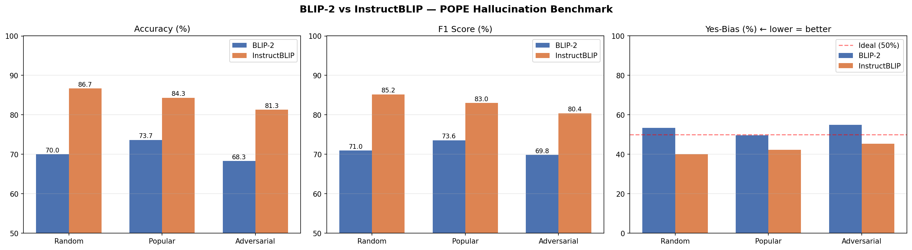
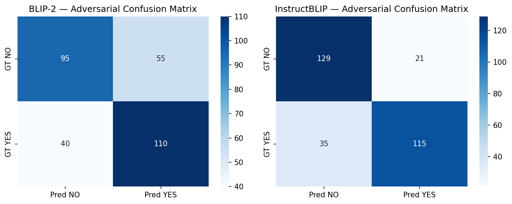
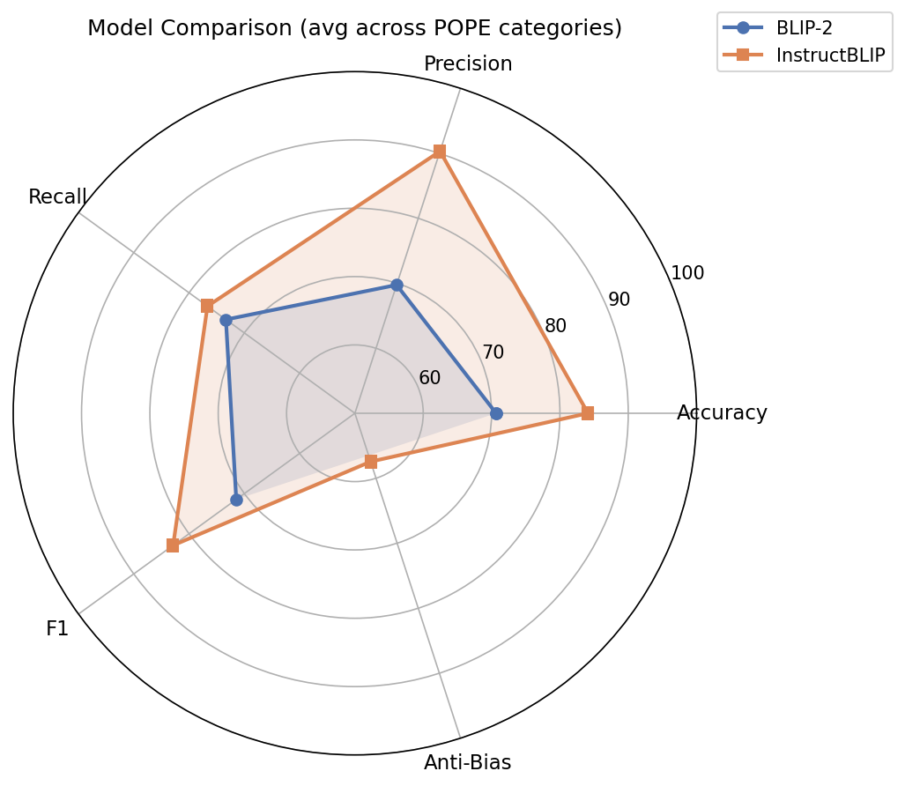

# Benchmarking Object Hallucination in Vision-Language Models via POPE


A quantitative evaluation pipeline to benchmark and compare **object hallucination** tendencies in Large Vision-Language Models (VLMs). This project evaluates **BLIP-2** and **InstructBLIP** using the **POPE (Polling-based Object Probing Evaluation)** framework across three probing settings on the COCO Val2014 dataset.

---

## 🔍 What is Object Hallucination?

Object hallucination is one of the most critical failure modes in multimodal AI — where a model confidently asserts the presence of objects that don't actually exist in the image. This project quantifies that tendency across three distinct probing configurations:

| Setting | Description |
|---|---|
| **Random** | Queries for completely random objects absent from the image |
| **Popular** | Queries for frequently occurring COCO objects to test frequency bias |
| **Adversarial** | Queries for contextually plausible but absent objects (e.g., asking "is there a sink?" in a kitchen that has none) |

---

## 📊 Results

Full results are logged in `results_summary.csv`. Summary below across 300 probing iterations per setting (900 total per model):

| Model | Setting | Accuracy | Precision | Recall | F1 | Yes-Bias |
|---|---|---|---|---|---|---|
| BLIP-2 (opt-2.7b) | Random | 70.00% | 68.75% | 73.33% | 70.97% | 53.33% |
| BLIP-2 (opt-2.7b) | Popular | 73.67% | 73.83% | 73.33% | 73.58% | 49.67% |
| BLIP-2 (opt-2.7b) | Adversarial | 68.33% | 66.67% | 73.33% | 69.84% | 55.00% |
| InstructBLIP (vicuna-7b) | Random | **86.67%** | **95.83%** | 76.67% | **85.19%** | **40.00%** |
| InstructBLIP (vicuna-7b) | Popular | **84.33%** | **90.55%** | 76.67% | **83.03%** | **42.33%** |
| InstructBLIP (vicuna-7b) | Adversarial | **81.33%** | **84.56%** | 76.67% | **80.42%** | **45.33%** |

> **Key takeaway:** InstructBLIP outperforms BLIP-2 by ~15% accuracy on average, with 2.6× fewer false positives under adversarial probing (21 vs 55), showing significantly stronger cross-modal grounding.

---

## 📈 Visualizations

### Accuracy & F1 Comparison


### Adversarial Confusion Matrix


> BLIP-2 shows a strong confirmation bias — 55 false positives under adversarial probing vs InstructBLIP's 21, highlighting its tendency to over-rely on language priors rather than visual evidence.

### Radar Chart — Avg Metrics Across All Settings


---

## 🛠️ Setup & Installation

### 1. Clone the repo

```bash
git clone https://github.com/yashikasharma2004/vlm-hallucination-benchmark.git
cd vlm-hallucination-benchmark
```

### 2. Install dependencies

```bash
pip install -r requirements.txt
```

### 3. Run the notebook

Open `vlm_hallucination_eval.ipynb` in Jupyter or Kaggle and run all cells.

---

## 🧰 Tech Stack

- **PyTorch** + **Hugging Face Transformers** — model loading and inference
- **accelerate** — `device_map="auto"` with float16 for memory-efficient evaluation on consumer GPUs
- **COCO Val2014** — evaluation dataset
- **POPE Framework** — structured hallucination probing

---

## 📁 File Structure

```
vlm-hallucination-benchmark/
├── vlm_hallucination_eval.ipynb   # Main evaluation notebook
├── requirements.txt               # Dependencies
├── results_summary.csv            # Full metrics log
├── blip2_results.json             # BLIP-2 output
├── final_results.json             # Combined results (both models)
├── pope_results.png               # Accuracy & F1 bar charts
├── confusion_matrix.png           # Adversarial confusion matrices
└── radar_chart.png                # Multi-metric radar comparison
```

---

## 📌 References

- [POPE: Polling-based Object Probing Evaluation](https://arxiv.org/abs/2305.10355)
- [BLIP-2 (Salesforce)](https://huggingface.co/Salesforce/blip2-opt-2.7b)
- [InstructBLIP (Salesforce)](https://huggingface.co/Salesforce/instructblip-vicuna-7b)
- [COCO Dataset](https://cocodataset.org/)


## 📄 License
This project is licensed under the MIT License.
